# C & Data Structures — Interview Questions

## Table of Contents

**C Language**
1. [C vs C++](#1-what-are-the-key-differences-between-c-and-c)
2. [Compilation process](#2-explain-the-compilation-process-of-a-c-program-from-source-code-to-executable)
3. [Program memory layout](#3-what-happens-when-you-run-a-c-program-in-memory-explain-text-data-heap-and-stack-segments)
4. [Declaration vs definition](#4-what-is-the-difference-between-declaration-and-definition-of-a-variabefunction-in-c)
5. [malloc/calloc/realloc/free](#5-explain-the-difference-between-malloc-calloc-realloc-and-free)
6. [Memory leaks](#6-what-are-memory-leaks-in-c-how-can-they-be-detected-and-avoided)
7. [Stack vs heap memory](#7-explain-stack-memory-vs-heap-memory-in-c)
8. [Dangling pointer](#8-what-is-a-dangling-pointer-how-does-it-occur)
9. [Wild pointer](#9-what-is-a-wild-pointer-how-is-it-different-from-a-dangling-pointer)
10. [Pointer vs array](#10-what-is-the-difference-between-a-pointer-and-an-array-in-c)
11. [Pointer arithmetic](#11-explain-pointer-arithmetic-on-what-types-of-pointers-is-arithmetic-allowed)
12. [Function call internals](#12-what-happens-internally-when-a-function-call-is-made-in-c)
13. [Call by value / reference](#13-explain-call-by-value-and-how-to-achieve-call-by-reference-in-c)
14. [Function pointers](#14-what-are-function-pointers-where-are-they-used-in-real-systems)
15. [const, static, extern, volatile](#15-what-is-the-difference-between-const-static-extern-and-volatile-keywords)
16. [struct vs union](#16-explain-the-difference-between-struct-and-union)
17. [Structure padding & alignment](#17-how-is-structure-padding-and-alignment-handled-by-the-compiler)
18. [Bit fields](#18-what-are-bit-fields-in-c-why-are-they-used)
19. [Macro vs inline function](#19-what-is-the-difference-between-macro-and-inline-function)
20. [Undefined behavior](#20-explain-undefined-behavior-in-c-with-examples)

**Data Structures**
21. [Arrays vs linked lists](#21-what-are-the-differences-between-arrays-and-linked-lists)
22. [Types of linked lists](#22-what-are-the-different-types-of-linked-lists-and-their-use-cases)
23. [Linked list memory layout](#23-how-does-a-linked-list-store-data-in-memory-compared-to-an-array)
24. [Linked list pros/cons](#24-what-are-the-advantages-and-disadvantages-of-using-linked-lists)
25. [Stack internals](#25-explain-how-a-stack-works-internally-where-is-it-used-in-real-systems)
26. [Queue internals](#26-explain-how-a-queue-works-internally-what-are-its-different-variations)
27. [Stack vs queue](#27-what-is-the-difference-between-stack-and-queue)
28. [Circular queue](#28-explain-circular-queue-and-why-it-is-needed)
29. [Tree data structures](#29-what-are-the-different-tree-data-structures-and-where-are-they-used)
30. [Binary tree vs BST](#30-what-is-the-difference-between-a-binary-tree-and-a-binary-search-tree)
31. [Tree traversals](#31-explain-tree-traversal-techniques-and-their-applications)
32. [Balanced trees](#32-what-is-a-balanced-tree-why-do-we-need-balanced-trees)
33. [AVL tree](#33-explain-avl-tree-and-how-balancing-is-achieved)
34. [Red-Black tree](#34-explain-red-black-tree-and-where-it-is-used)
35. [Heap data structure](#35-what-is-a-heap-data-structure-difference-between-min-heap-and-max-heap)
36. [Priority queue internals](#36-how-are-priority-queues-implemented-internally)
37. [Hashing](#37-what-is-hashing-how-does-a-hash-table-work-internally)
38. [Collision handling](#38-what-are-collision-handling-techniques-in-hashing)
39. [Graph representations](#39-explain-graph-representations-adjacency-matrix-vs-adjacency-list)
40. [BFS vs DFS](#40-what-are-the-differences-between-bfs-and-dfs-and-where-are-they-used)

---

## 1. What are the key differences between C and C++?

C is **procedural**; C++ is **multi-paradigm** (procedural + object-oriented + generic). C++ was originally built as "C with Classes."

| Aspect | C | C++ |
|---|---|---|
| Paradigm | Procedural | OOP, procedural, generic |
| Classes/Objects | No (uses `struct`) | Yes |
| Encapsulation | Not enforced | `public`/`private`/`protected` |
| Function overloading | Not supported | Supported |
| Templates (generics) | No | Yes |
| Exception handling | No (`errno`, return codes) | `try`/`catch`/`throw` |
| Reference variables | No | Yes (`int &r = x;`) |
| `new`/`delete` | No — uses `malloc`/`free` | Yes (also constructor/destructor aware) |
| Standard Library | `stdio.h`, `stdlib.h`, etc. | STL (`vector`, `map`, `algorithm`...) |
| Compilation | `.c` → C compiler | `.cpp` → C++ compiler (superset semantics) |
| `struct` | Only data, no member functions | Can have member functions, constructors |
| Strictness | Looser type checking | Stricter type checking |

```c
// C: no overloading — names must differ
int add_int(int a, int b);
float add_float(float a, float b);
```
```cpp
// C++: overloading allowed
int add(int a, int b);
float add(float a, float b);
```

**Why it matters in interviews:** C++ is "almost" backward compatible with C, but not fully — e.g., C allows implicit `void*` → `T*` conversion, C++ doesn't; C allows a function with empty `()` to take any args, C++ treats `()` as `(void)`.

---

## 2. Explain the compilation process of a C program from source code to executable.

A `.c` file goes through **four distinct stages** before becoming a runnable binary. Each stage is a separate tool (you can run them individually with `gcc -E`, `-S`, `-c`):

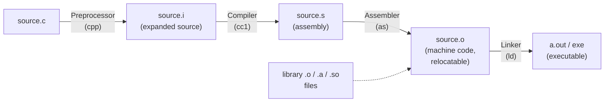

| Stage | Tool | What happens | Command to inspect |
|---|---|---|---|
| **Preprocessing** | `cpp` | Expands `#include`, `#define` macros, removes comments, resolves `#ifdef` | `gcc -E source.c -o source.i` |
| **Compilation** | `cc1` | Translates preprocessed C into assembly for the target architecture; does syntax/semantic checks | `gcc -S source.c -o source.s` |
| **Assembly** | `as` | Converts assembly into machine code, producing a relocatable object file with symbol table | `gcc -c source.c -o source.o` |
| **Linking** | `ld` | Resolves external symbols (library functions like `printf`), combines all `.o` files and libraries into one executable, assigns final memory addresses | `gcc source.o -o source` |

```bash
gcc -E hello.c -o hello.i     # Stage 1: preprocessed output
gcc -S hello.i -o hello.s     # Stage 2: assembly
gcc -c hello.s -o hello.o     # Stage 3: object file
gcc hello.o -o hello          # Stage 4: linked executable
./hello
```

**Linking has two flavors:**
- **Static linking** — library code is copied into the executable (`.a` files). Bigger binary, no runtime dependency.
- **Dynamic linking** — library code is referenced and resolved at load/run time (`.so` files on Linux, `.dll` on Windows). Smaller binary, shared across processes, needs the library present at runtime.

A common interview follow-up: **"What's in an object file?"** — machine code + a symbol table (defined and undefined/external symbols) + relocation info, but addresses aren't final until linking.

---

## 3. What happens when you run a C program in memory? Explain text, data, heap, and stack segments.

When an executable is loaded, the OS creates a **process address space** divided into segments:

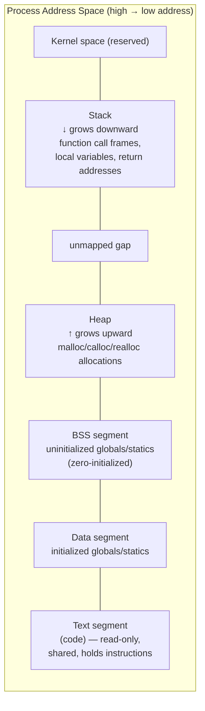

| Segment | Contains | Notes |
|---|---|---|
| **Text (code)** | Compiled machine instructions | Read-only, often shared between processes running the same binary |
| **Data** | **Initialized** global and `static` variables | e.g. `int count = 5;` at global scope |
| **BSS** | **Uninitialized** global/`static` variables | Zero-filled by the OS at load time, e.g. `static int arr[100];` |
| **Heap** | Dynamically allocated memory (`malloc`, `calloc`, etc.) | Grows upward; managed manually — programmer must `free()` |
| **Stack** | Function call frames: local variables, parameters, return address | Grows downward; managed automatically by the compiler/OS; LIFO |

```c
#include <stdio.h>
#include <stdlib.h>

int global_initialized = 10;      // Data segment
int global_uninitialized;         // BSS segment
static int static_var;            // BSS segment

void demo(int param) {            // param -> Stack
    int local = 5;                 // Stack
    static int local_static = 1;   // Data segment (static = lives across calls)
    int *heap_ptr = malloc(sizeof(int)); // pointer itself on Stack,
                                          // memory it points to -> Heap
    *heap_ptr = 42;
    printf("%d %d\n", local, *heap_ptr);
    free(heap_ptr);
}

int main(void) {
    demo(1);
    return 0;
}
```

You can verify segment sizes of a compiled binary with `size ./a.out`, which prints `text`, `data`, and `bss` sizes.

**Common interview trap:** "Does the stack grow up or down?" — On most architectures (x86, ARM) it grows **downward** (toward lower addresses), while the heap grows **upward**. This is why a stack overflow colliding with the heap is a classic failure mode in unbounded recursion.

---

## 4. What is the difference between declaration and definition of a variable/function in C?

- **Declaration**: tells the compiler the *name and type* exist somewhere — no memory is allocated, no function body is created. You can declare something multiple times.
- **Definition**: actually *creates* the variable (allocates memory) or *implements* the function body. A definition is also a declaration, but not vice versa. You can only define something **once** (One Definition Rule, loosely, for C).

```c
// Declarations (no memory/storage created)
extern int counter;          // variable declaration
int add(int a, int b);       // function declaration (prototype)

// Definitions (memory/storage created)
int counter = 0;             // variable definition
int add(int a, int b) {      // function definition
    return a + b;
}
```

| | Declaration | Definition |
|---|---|---|
| Memory allocated? | No | Yes |
| Can repeat? | Yes, multiple times | No, only once per translation unit (linked program) |
| Example | `extern int x;` | `int x;` or `int x = 5;` |
| Function example | `int f(int);` | `int f(int a) { return a*2; }` |

**Why this matters:** this split is what makes multi-file C programs possible. A header file (`.h`) holds *declarations*; a `.c` file holds the *definition*. Other `.c` files `#include` the header and the linker resolves the actual address from the file that defines it.

```c
// file: math_utils.h
extern int counter;        // declaration — usable in any file that includes this
int square(int x);         // declaration

// file: math_utils.c
int counter = 0;           // definition — memory allocated here, once
int square(int x) { return x * x; }  // definition

// file: main.c
#include "math_utils.h"
int main(void) {
    counter = 5;            // linker resolves this to math_utils.c's `counter`
    return square(counter);
}
```

---

## 5. Explain the difference between malloc(), calloc(), realloc(), and free().

All four live in `stdlib.h` and operate on the **heap**.

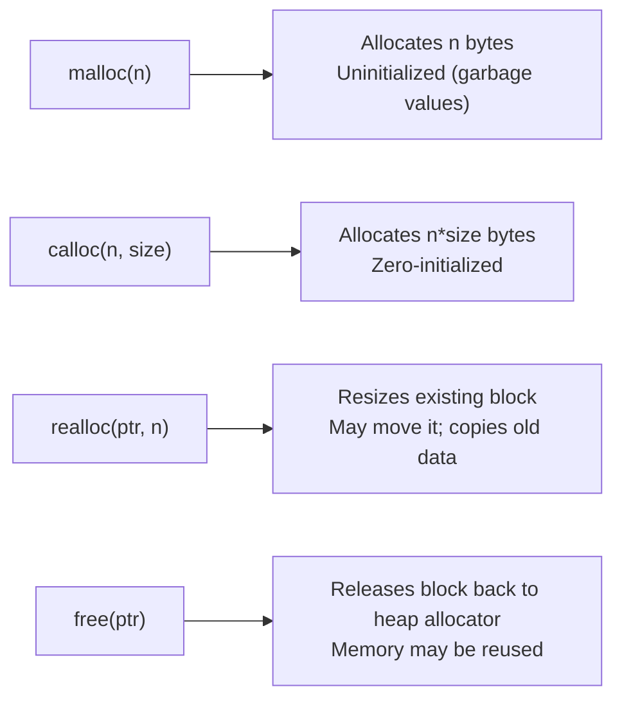

| Function | Signature | Initializes memory? | Notes |
|---|---|---|---|
| `malloc` | `void* malloc(size_t size)` | No (garbage values) | Single block of `size` bytes |
| `calloc` | `void* calloc(size_t n, size_t size)` | **Yes**, to zero | Allocates `n` elements of `size` bytes each; safer for arrays |
| `realloc` | `void* realloc(void* ptr, size_t new_size)` | New region beyond old size is uninitialized | Grows/shrinks a previous allocation; **may return a different address**; old data preserved up to `min(old,new)` size |
| `free` | `void free(void* ptr)` | — | Returns memory to the heap allocator; does **not** set `ptr` to `NULL` automatically |

```c
#include <stdio.h>
#include <stdlib.h>

int main(void) {
    // malloc: 5 ints, garbage values
    int *a = malloc(5 * sizeof(int));

    // calloc: 5 ints, all zero-initialized
    int *b = calloc(5, sizeof(int));

    // realloc: grow b to 10 ints — old 5 values preserved, rest garbage
    int *temp = realloc(b, 10 * sizeof(int));
    if (temp == NULL) {
        // realloc failed — original b is still valid, must free it
        free(b);
        return 1;
    }
    b = temp;  // always reassign via a temp pointer to avoid leaking on failure

    free(a);
    free(b);
    a = NULL;  // good practice: avoid dangling pointer reuse
    b = NULL;
    return 0;
}
```

**Critical interview point — `realloc` failure pattern:**
```c
ptr = realloc(ptr, new_size);   // BUG: if realloc fails (-> NULL), original block is leaked
```
Always use a temporary pointer, as shown above, so the original allocation isn't lost if `realloc` returns `NULL`.

Full runnable demo: `code/c/malloc_calloc_realloc_free.c`

---

## 6. What are memory leaks in C? How can they be detected and avoided?

A **memory leak** happens when heap memory is allocated (`malloc`/`calloc`/`realloc`) but never `free`d, and the program loses all references (pointers) to it — so it can never be freed, even though it's still "reserved" until the process exits.

```c
void leaky_function(void) {
    int *data = malloc(100 * sizeof(int)); // allocated
    data[0] = 42;
    // function returns WITHOUT free(data)
    // -> `data` pointer goes out of scope, but memory is still reserved
    // -> 400 bytes leaked, unreachable for the rest of the program's life
}
```

**Common causes:**
1. Forgetting `free()` after `malloc`/`calloc`.
2. Overwriting the only pointer to an allocated block before freeing it (`ptr = malloc(...); ptr = malloc(...);` — first block leaked).
3. Losing the pointer on an early `return` or exception path.
4. Freeing a struct but not its internal pointer members ("partial free").
5. Circular references in manually-managed linked structures.

```c
// Cause #2 — overwrite without freeing
int *p = malloc(sizeof(int) * 10);
p = malloc(sizeof(int) * 20);   // first block's address is gone -> leaked

// Cause #4 — partial free
typedef struct { char *name; int age; } Person;
Person *pr = malloc(sizeof(Person));
pr->name = malloc(50);
free(pr);          // leaks pr->name! must free(pr->name) first
```

**Detection tools:**
| Tool | Platform | How |
|---|---|---|
| `valgrind --leak-check=full` | Linux | Runs binary, reports leaked blocks + allocation stack trace |
| AddressSanitizer (`-fsanitize=address`) | GCC/Clang | Compile-time instrumentation, fast, catches leaks + overflows |
| `gdb` + manual instrumentation | Any | Track allocation counts |
| Static analyzers (`cppcheck`, `clang-tidy`) | Any | Flags obvious leak patterns without running the program |

```bash
gcc -fsanitize=address -g leaky.c -o leaky
./leaky    # prints leak report on exit
```

**Avoidance strategies:**
- Pair every `malloc`/`calloc` with exactly one `free`, ideally at a clearly owned point ("ownership" discipline).
- Set pointers to `NULL` after freeing.
- For structs with nested pointers, write a `free_X()` function that frees members in the correct order, then the struct itself.
- Use tools like Valgrind/ASan in CI, not just locally.
- Consider RAII-like patterns (`goto cleanup;` blocks) for functions with multiple exit points.

```c
int process(void) {
    int *buf1 = malloc(100);
    if (!buf1) return -1;
    int *buf2 = malloc(200);
    if (!buf2) { free(buf1); return -1; }   // must free buf1 on this path too

    // ... use buf1, buf2 ...

    free(buf1);
    free(buf2);
    return 0;
}
```

---

## 7. Explain stack memory vs heap memory in C.

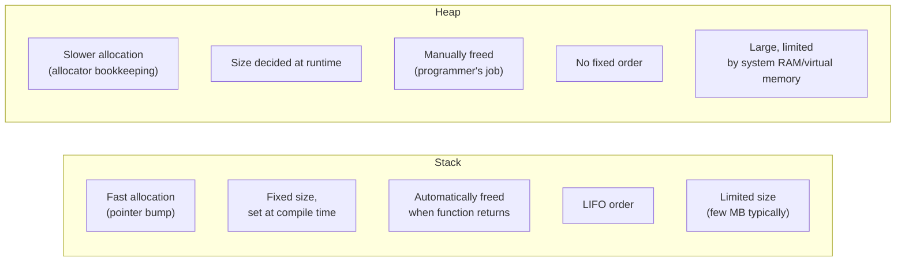

| Aspect | Stack | Heap |
|---|---|---|
| Allocation | Automatic (compiler-managed) | Manual (`malloc`/`free`) |
| Speed | Very fast (just moves stack pointer) | Slower (allocator searches free list, bookkeeping) |
| Lifetime | Tied to scope/function call | Until explicitly freed (or process exit) |
| Size | Fixed, limited (e.g., 1–8 MB default) | Large, limited by available memory |
| Fragmentation | None | Can fragment over time |
| Access pattern | LIFO | Random access, any order |
| Failure mode | Stack overflow (deep recursion, huge local arrays) | Out of memory, or leaks accumulate |
| Typical use | Local variables, function parameters | Dynamic-size data, data that outlives a function call |

```c
void stack_example(void) {
    int arr[100];       // 400 bytes on stack — gone when function returns
}

int* heap_example(void) {
    int *arr = malloc(100 * sizeof(int)); // 400 bytes on heap — survives return
    return arr;          // valid! caller must free() it eventually
}

int* BAD_stack_return(void) {
    int local = 5;
    return &local;        // BUG: returns address of stack memory that's
}                          // invalid the instant the function returns
```

**Interview gotcha:** returning the address of a local (stack) variable from a function is undefined behavior — the memory may be overwritten by the very next function call. This is one of the most common C bugs asked about in interviews.

---

## 8. What is a dangling pointer? How does it occur?

A **dangling pointer** points to memory that has already been freed/deallocated — the pointer's value (address) is no longer valid, but the pointer itself hasn't been updated to reflect that.

```mermaid
sequenceDiagram
    participant P as Pointer p
    participant M as Heap memory
    P->>M: p = malloc(...)  (p points to valid block)
    Note over M: block holds valid data
    P->>M: free(p)
    Note over M: block returned to allocator,\nmay be reused by next malloc
    Note over P: p still holds the OLD address\n-> p is now DANGLING
    P->>M: *p = 5;  (writes to memory\nthat may belong to something else now)
```

**Three classic ways dangling pointers occur:**

```c
// 1. Freeing memory but not nulling the pointer
int *p = malloc(sizeof(int));
free(p);
*p = 10;        // BUG: p is dangling — undefined behavior

// 2. Returning the address of a local (stack) variable
int* get_value(void) {
    int x = 5;
    return &x;   // x's stack frame is destroyed on return
}                // caller now holds a dangling pointer

// 3. Two pointers to the same memory; freeing one leaves the other dangling
int *a = malloc(sizeof(int));
int *b = a;
free(a);
// b is now dangling too, even though only `a` was freed
```

**Fix / prevention:**
```c
free(p);
p = NULL;     // dereferencing NULL crashes predictably (segfault)
              // instead of corrupting memory silently
```
Setting freed pointers to `NULL` converts a *silent memory-corruption bug* into a *loud, immediate crash* — far easier to debug. Tools like Valgrind/ASan also catch use-after-free directly.

---

## 9. What is a wild pointer? How is it different from a dangling pointer?

A **wild pointer** is a pointer that has **never been initialized** — it holds whatever garbage address was in memory when it was declared. A **dangling pointer**, by contrast, *was* valid at some point but became invalid after the memory it pointed to was freed.

```c
int *wild;          // wild pointer — uninitialized, contains garbage address
*wild = 5;           // BUG: writes to a random, unknown memory location
                      // could crash, could silently corrupt unrelated data

int *p = malloc(sizeof(int));
free(p);              // p is now dangling — it WAS valid, now isn't
```

| Aspect | Wild Pointer | Dangling Pointer |
|---|---|---|
| Cause | Never initialized | Was valid, became invalid (freed / out of scope) |
| Points to | Completely random/garbage address | A specific address that *was* legitimately allocated |
| Example | `int *p;` (no assignment) | `int *p = malloc(...); free(p);` |
| Fix | Always initialize: `int *p = NULL;` | Set to `NULL` after `free()` |

```c
// Wild pointer — fix
int *p = NULL;   // not wild anymore; NULL is a well-defined "points to nothing"
if (p != NULL) { *p = 5; }   // safe check before use

// Dangling pointer — fix
int *q = malloc(sizeof(int));
free(q);
q = NULL;
```

**Memory aid for interviews:** *"Wild pointers were never tamed (initialized); dangling pointers used to be tame but got cut loose (freed)."*

---

## 10. What is the difference between a pointer and an array in C?

This is one of the most misunderstood areas in C. Arrays and pointers are closely related — an array name *decays* into a pointer to its first element in most expressions — but they are **not the same thing**.

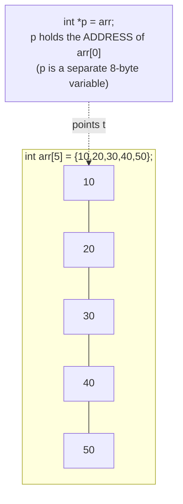

| Aspect | Array | Pointer |
|---|---|---|
| What it is | A block of contiguous memory holding elements | A variable that stores an address |
| Memory | Allocated for all elements at declaration | Only allocated for the address itself (4 or 8 bytes) |
| `sizeof` | Total size (`elements × sizeof(type)`) | Size of a pointer (typically 8 bytes on 64-bit) |
| Reassignable? | No — `arr = ...` is illegal | Yes — `p = &other_var;` is legal |
| `&arr` vs `&p` | `&arr` gives `type(*)[N]` (pointer to whole array) | `&p` gives `type**` (pointer to pointer) |
| Initialization | Can be initialized with `{}` list | Must be assigned an address |

```c
#include <stdio.h>

int main(void) {
    int arr[5] = {10, 20, 30, 40, 50};
    int *p = arr;     // array decays to pointer to arr[0]

    printf("sizeof(arr) = %zu\n", sizeof(arr));  // 20 (5 * 4 bytes)
    printf("sizeof(p)   = %zu\n", sizeof(p));     // 8  (just a pointer)

    printf("arr[2] = %d\n", arr[2]);   // 30
    printf("*(p+2) = %d\n", *(p + 2)); // 30 — same element, pointer arithmetic

    // arr = p;   // COMPILE ERROR: array name is not a modifiable lvalue
    p = arr + 1;    // legal: pointer CAN be reassigned

    return 0;
}
```

**Key nuance interviewers probe:** `arr[i]` is literally syntactic sugar for `*(arr + i)` — this is why `5[arr]` is *also* legal C (evaluates to `*(5 + arr)`, same as `*(arr + 5)`). But this equivalence only holds for *expressions*; an array is not a pointer at the storage/declaration level — `sizeof` is the proof.

---
## 11. Explain pointer arithmetic. On what types of pointers is arithmetic allowed?

Pointer arithmetic is **scaled** by the size of the pointed-to type — `p + 1` doesn't add 1 byte, it adds `sizeof(*p)` bytes.

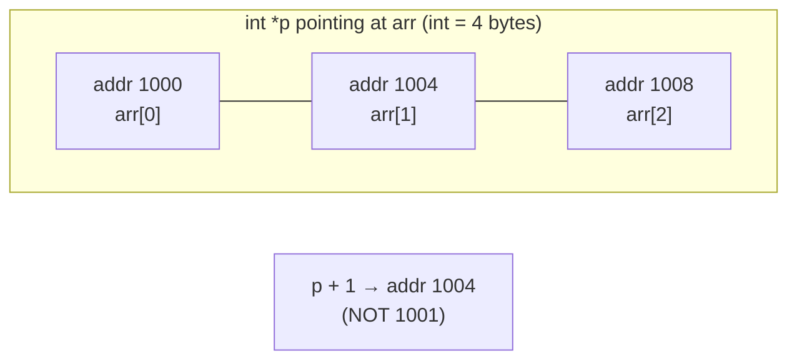

| Operation | Meaning | Allowed? |
|---|---|---|
| `p + n` | Move pointer forward by `n` elements | Yes, on array/pointer types |
| `p - n` | Move pointer backward by `n` elements | Yes |
| `p1 - p2` | Number of elements between two pointers (same array) | Yes — result type `ptrdiff_t` |
| `p1 + p2` | Adding two addresses | **No** — meaningless, compile error |
| `p++` / `p--` | Increment/decrement to next/prev element | Yes |
| Arithmetic on `void*` | Adding to a pointer with no known size | **Not standard C** (GCC allows as extension, treats as `char*`) |
| Comparison (`<`, `>`, `==`) | Only valid for pointers into the *same* array/object | Otherwise undefined behavior |

```c
int arr[5] = {10, 20, 30, 40, 50};
int *p = arr;

printf("%d\n", *(p + 2));   // 30 — p+2 skips 2*sizeof(int) = 8 bytes
printf("%d\n", *(arr + 2)); // 30 — same thing, array decays to pointer
printf("%ld\n", (p + 4) - p); // 4 — pointer subtraction gives element count, not bytes

char *cp = (char*)arr;
printf("%d\n", *(int*)(cp + 8)); // also 30 — cp+8 moves 8 BYTES since char is 1 byte
```

**Why it's only allowed on array-like pointers:** arithmetic is only well-defined within a single array object (including one element past the end, for loop-termination comparisons). Pointers to unrelated objects (e.g., two separately `malloc`'d blocks) cannot be meaningfully subtracted or compared with `<`/`>` — the standard leaves that undefined.

---

## 12. What happens internally when a function call is made in C?

Each function call pushes a **stack frame (activation record)** onto the call stack. This is typically managed via a "function prologue" and "epilogue" in the generated assembly.

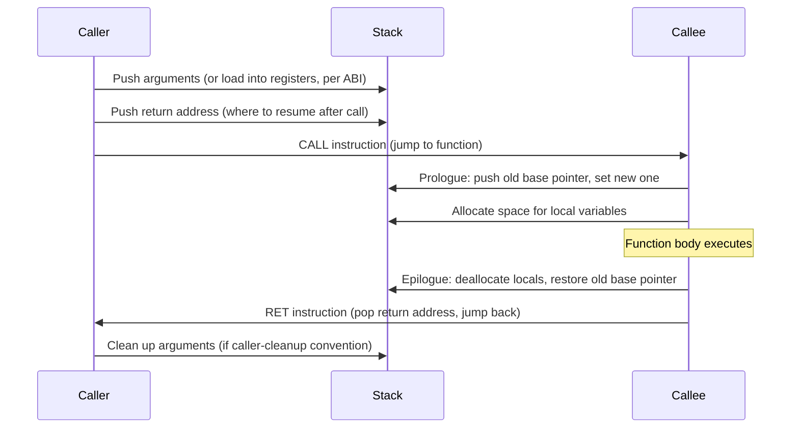

**Stack frame layout (typical x86-64):**

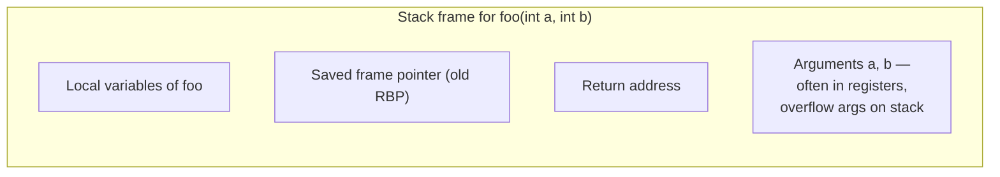

**Step by step:**
1. **Arguments** are placed in registers (per calling convention, e.g. System V AMD64: `rdi, rsi, rdx, rcx, r8, r9` for the first 6 integer args) or pushed on the stack if there are more than fit in registers.
2. **Return address** is pushed automatically by the `call` instruction — it's where execution resumes after the function finishes.
3. **Prologue**: the callee saves the caller's base/frame pointer and sets up its own, then reserves stack space for local variables.
4. **Function body executes**, using stack space for locals and registers for temporaries.
5. **Epilogue**: local variable space is released, the old frame pointer is restored.
6. **`ret`** pops the return address off the stack and jumps back to the caller.
7. The **return value** is placed in a designated register (`eax`/`rax` on x86).

```c
int add(int a, int b) {   // a, b arrive in registers (rdi, rsi)
    int result = a + b;    // result lives in this frame's stack space
    return result;          // result placed in rax before ret
}

int main(void) {
    int sum = add(3, 4);    // call pushes return address; after ret, sum = rax's value
    return 0;
}
```

This mechanism is also why **deep/unbounded recursion causes a stack overflow** — every call adds a frame, and frames keep stacking until the fixed-size stack region is exhausted.

---

## 13. Explain call by value and how to achieve call by reference in C.

C is strictly **call by value** — when you pass an argument to a function, a **copy** is made. The function operates on the copy; changes don't affect the caller's original variable.

```c
void try_modify(int x) {
    x = 100;          // modifies the LOCAL COPY only
}

int main(void) {
    int a = 5;
    try_modify(a);
    printf("%d\n", a);  // still 5 — unaffected
}
```

**C has no true "pass by reference" syntax** (unlike C++'s `&`). Instead, the common workaround is to **pass a pointer** (the address) — this is still technically call-by-value (the address itself is copied), but since the copy holds the same address, dereferencing it lets you modify the original.

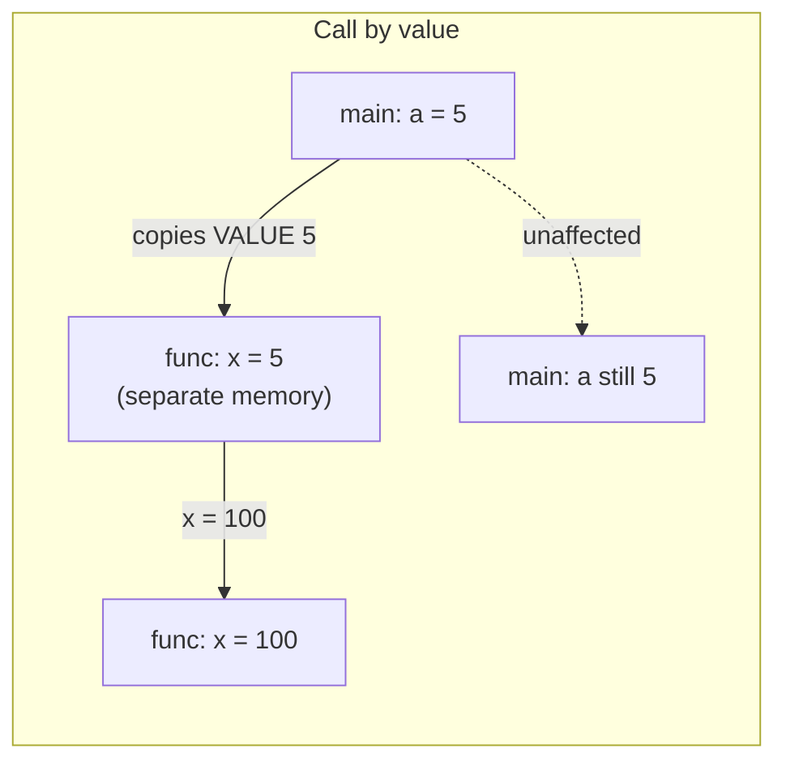

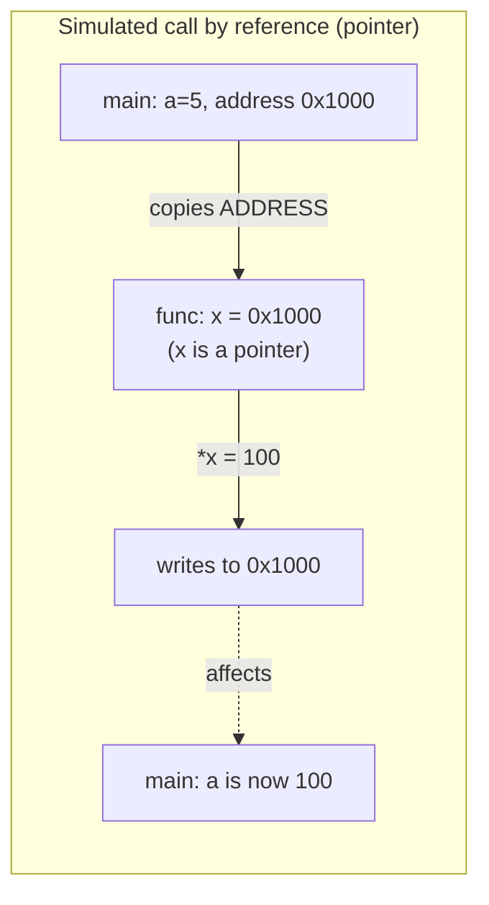

```c
void modify_by_pointer(int *x) {
    *x = 100;     // dereference: writes to the ORIGINAL memory location
}

int main(void) {
    int a = 5;
    modify_by_pointer(&a);   // pass the address of a
    printf("%d\n", a);        // 100 — original changed
    return 0;
}
```

This pattern is everywhere in C: `scanf("%d", &x)`, swap functions, functions returning multiple values via output parameters, etc.

```c
void swap(int *a, int *b) {
    int temp = *a;
    *a = *b;
    *b = temp;
}
// swap(&x, &y); actually swaps x and y in the caller
```

Full demo: `code/c/call_by_value_reference.c`

---

## 14. What are function pointers? Where are they used in real systems?

A **function pointer** stores the *address of a function* instead of data — letting you call functions indirectly, store them in variables/arrays/structs, and pass them as arguments (callbacks).

```c
#include <stdio.h>

int add(int a, int b) { return a + b; }
int subtract(int a, int b) { return a - b; }

int main(void) {
    int (*operation)(int, int);   // declare a function pointer:
                                    // points to a function taking (int,int) -> int
    operation = add;
    printf("%d\n", operation(3, 4));  // 7

    operation = subtract;
    printf("%d\n", operation(3, 4));  // -1

    return 0;
}
```

**Reading the declaration:** `int (*operation)(int, int);` — the parentheses around `*operation` are essential; without them, `int *operation(int, int)` would declare a function *returning* `int*`, which is different.

**Real-world uses:**

| Use case | How |
|---|---|
| **Callbacks** | `qsort(arr, n, sizeof(int), compare_fn)` — `qsort` calls your `compare_fn` internally |
| **Dispatch tables / "vtables"** | Array of function pointers indexed by an opcode/event type, used to implement polymorphism-like behavior in C, or interpreters |
| **Plugin/driver architectures** | Linux kernel `struct file_operations` holds function pointers (`.read`, `.write`, `.open`) so each driver implements them differently, but is called uniformly |
| **State machines** | Each state maps to a handler function pointer; transition = updating the pointer |
| **Event-driven systems / GUI** | Button click handlers stored as function pointers |

```c
// Dispatch table example
typedef void (*Handler)(void);

void on_start(void) { printf("starting\n"); }
void on_stop(void)  { printf("stopping\n"); }

Handler table[2] = { on_start, on_stop };

int main(void) {
    table[0]();  // calls on_start
    table[1]();  // calls on_stop
}
```

```c
// qsort callback example
#include <stdlib.h>
int compare(const void *a, const void *b) {
    return (*(int*)a - *(int*)b);
}
int arr[] = {5, 2, 8, 1};
qsort(arr, 4, sizeof(int), compare);  // qsort calls compare() internally
```

Full demo: `code/c/function_pointers.c`

---

## 15. What is the difference between const, static, extern, and volatile keywords?

| Keyword | Meaning | Scope/lifetime effect |
|---|---|---|
| `const` | Value cannot be modified after initialization (compile-time enforced) | No effect on scope/storage; only mutability |
| `static` (local var) | Variable retains its value between function calls | Lifetime = whole program, but scope stays local to function |
| `static` (global var/func) | Restricts visibility to the current file (internal linkage) | Hides symbol from other translation units |
| `extern` | Declares that a variable/function is **defined elsewhere** (another file) | Used to share globals across files |
| `volatile` | Tells the compiler the value may change unexpectedly (hardware, another thread/ISR) — disables optimizations that assume the value is stable | No storage effect, only optimization behavior |

```c
// const — read-only
const int max_size = 100;
// max_size = 200;   // COMPILE ERROR

// static local — keeps value across calls
void counter(void) {
    static int count = 0;   // initialized only ONCE, ever
    count++;
    printf("%d\n", count);  // prints 1, 2, 3, ... on successive calls
}

// static global/function — file-private (internal linkage)
static int internal_helper(void) { return 42; }  // invisible to other .c files

// extern — shared across files
// file1.c:
int shared_value = 10;          // definition
// file2.c:
extern int shared_value;        // declaration — refers to file1.c's variable
void use_it(void) { printf("%d\n", shared_value); }

// volatile — for memory-mapped hardware registers, signal handlers, threads
volatile int flag = 0;
// Without volatile, the compiler might cache flag in a register and
// never re-check memory, missing updates from an interrupt handler.
```

**Combining `const` and pointers** is a frequent interview trap:
```c
const int *p1;        // pointer to const int — *p1 can't change, p1 itself can
int * const p2 = &x;   // const pointer to int — p2 can't change, *p2 can
const int * const p3 = &x;  // neither can change
```

**`volatile` real-world example:** an embedded systems register polling loop —
```c
volatile uint32_t *status_register = (uint32_t*)0x40000000;
while (*status_register == 0) {
    // without volatile, compiler may optimize this into an infinite loop
    // by reading the register only once and caching it in a register
}
```

---

## 16. Explain the difference between struct and union.

Both group multiple variables of different types under one name, but they differ fundamentally in **memory layout**.

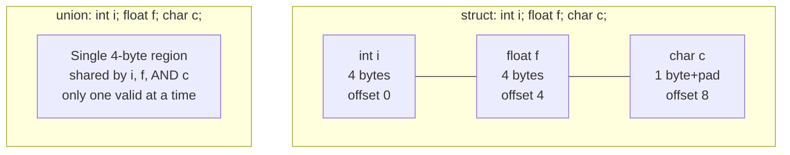

| Aspect | `struct` | `union` |
|---|---|---|
| Memory | Each member gets **its own space** — total size ≥ sum of members (plus padding) | All members **share the same memory** — size = size of the largest member |
| Simultaneous access | All members valid simultaneously | Only **one** member is valid at any given time — writing one overwrites others |
| Use case | Group related, independently-needed data (a "record") | Save memory when only one of several types is needed at a time (a "variant") |

```c
#include <stdio.h>

struct S { int i; float f; char c; };
union  U { int i; float f; char c; };

int main(void) {
    printf("sizeof(struct S) = %zu\n", sizeof(struct S)); // e.g. 12 (with padding)
    printf("sizeof(union U)  = %zu\n", sizeof(union U));  // 4 (size of largest: int/float)

    union U u;
    u.i = 65;
    printf("%d\n", u.i);     // 65
    u.f = 3.14f;               // OVERWRITES u.i's memory
    printf("%f\n", u.f);      // 3.14
    printf("%d\n", u.i);      // garbage now — i's bytes were overwritten by f

    return 0;
}
```

**Real use cases for `union`:**
- Network packet parsing — interpret the same bytes as different formats depending on a type tag.
- Tagged unions / variant types — pair a `union` with an `enum` tag to build a type-safe "one of several types" value.
- Memory-constrained embedded systems where only one of several mutually-exclusive fields is ever live.

```c
// Tagged union pattern
typedef enum { TYPE_INT, TYPE_FLOAT } ValueType;
typedef struct {
    ValueType type;
    union { int i; float f; } data;
} Value;

Value v;
v.type = TYPE_INT;
v.data.i = 42;
if (v.type == TYPE_INT) printf("%d\n", v.data.i);
```

---

## 17. How is structure padding and alignment handled by the compiler?

Compilers insert **padding bytes** between struct members so each member starts at an address that's a multiple of its **alignment requirement** (usually equal to its size, for primitive types). This makes memory access faster on most CPU architectures, which often can't efficiently access misaligned data.

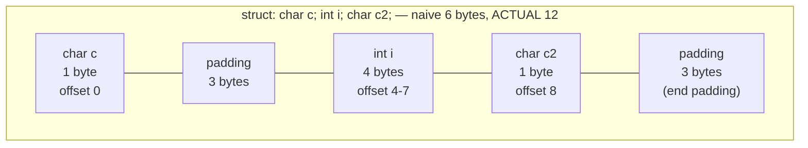

```c
#include <stdio.h>

struct Bad {
    char c;     // 1 byte
    int i;      // 4 bytes
    char c2;    // 1 byte
};
// Naive sum: 1+4+1 = 6, but actual size is 12 due to padding!

struct Good {
    int i;      // 4 bytes
    char c;     // 1 byte
    char c2;    // 1 byte
};
// padded to 8 (2 bytes trailing padding) — better than 12!

int main(void) {
    printf("sizeof(struct Bad)  = %zu\n", sizeof(struct Bad));   // 12
    printf("sizeof(struct Good) = %zu\n", sizeof(struct Good));  // 8
    return 0;
}
```

**Rules the compiler follows:**
1. Each member is placed at an offset that's a multiple of its own alignment (typically its size, up to the platform's word size).
2. Padding is inserted *between* members as needed to satisfy rule 1.
3. The **total struct size** is padded at the end to be a multiple of the struct's overall alignment (usually the largest member's alignment) — this matters for arrays of structs, so each element stays aligned.

**Practical takeaway — member ordering matters:** ordering struct members from **largest to smallest** alignment typically minimizes padding (as shown in `Good` above).

**Controlling it manually:**
```c
#pragma pack(push, 1)     // GCC/MSVC extension: disable padding
struct Packed {
    char c;
    int i;
    char c2;
};   // sizeof == 6, no padding — but slower/unaligned access on some CPUs
#pragma pack(pop)

// Or, portable C11 attribute:
struct __attribute__((packed)) PackedGCC { char c; int i; };
```
Packed structs are common in **network protocol headers** and **binary file formats**, where the exact byte layout matters more than access speed and must match an external spec.

---

## 18. What are bit fields in C? Why are they used?

A **bit field** lets you specify the exact number of bits a struct member should occupy, instead of the full byte-aligned size of its type. This packs multiple small values tightly into fewer bytes.

```c
struct Flags {
    unsigned int is_active : 1;   // uses only 1 bit
    unsigned int priority  : 3;   // uses only 3 bits (0-7)
    unsigned int type      : 4;   // uses only 4 bits (0-15)
};
// Total: 8 bits = 1 byte, instead of 3 separate ints (12 bytes)
```

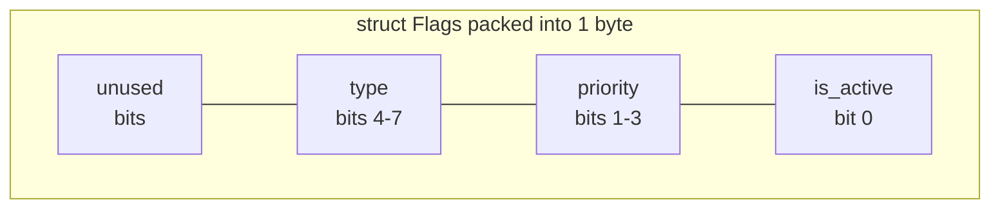

```c
#include <stdio.h>

struct Flags {
    unsigned int is_active : 1;
    unsigned int priority  : 3;
    unsigned int type      : 4;
};

int main(void) {
    struct Flags f;
    f.is_active = 1;
    f.priority = 5;   // fits in 3 bits (max 7)
    f.type = 9;        // fits in 4 bits (max 15)

    printf("sizeof(struct Flags) = %zu\n", sizeof(struct Flags)); // typically 4 (int-aligned) or less
    printf("%d %d %d\n", f.is_active, f.priority, f.type);
    return 0;
}
```

**Why used:**
- **Memory-constrained systems** (embedded, kernel data structures) — pack many boolean/small-range flags into minimal space.
- **Hardware register mapping** — many hardware registers define specific bit ranges for specific meanings (e.g., a status register where bits 0-3 = error code, bit 4 = ready flag).
- **Protocol headers** — e.g., IP header's version (4 bits) + IHL (4 bits) packed into one byte.

**Caveats interviewers like to probe:**
- Bit field memory layout (bit order, padding between fields) is **implementation-defined** — not portable across compilers/platforms.
- You **cannot take the address** of a bit field member (`&f.priority` is illegal) since it isn't necessarily byte-aligned.
- Bit fields can be slower to access than full-word members due to extra masking/shifting instructions.

---

## 19. What is the difference between macro and inline function?

Both aim to avoid function-call overhead for small, frequently used code, but they work very differently.

| Aspect | Macro (`#define`) | `inline` function |
|---|---|---|
| Processing stage | Preprocessor (pure text substitution) | Compiler (type-checked, real function) |
| Type checking | None — just text replacement | Yes — full type checking |
| Debugging | Hard (debugger sees expanded code, not macro name) | Easy (behaves like a normal function in a debugger) |
| Side-effect safety | Unsafe — arguments can be evaluated multiple times | Safe — arguments evaluated once, as normal function calls |
| Scope | No scope — pure text substitution anywhere | Has proper function scope |
| Can be recursive? | No | Yes |
| Inlining guarantee | N/A (it's just text) | A *hint* to the compiler — not guaranteed |

```c
// MACRO — classic bug: double-evaluation of side effects
#define SQUARE(x) ((x) * (x))

int main(void) {
    int a = 5;
    printf("%d\n", SQUARE(a));        // 25, fine
    printf("%d\n", SQUARE(a++));      // BUG: expands to ((a++) * (a++))
                                        // -> undefined behavior / unexpected result
}

// INLINE FUNCTION — safe, evaluates argument once
static inline int square(int x) {
    return x * x;
}
int main(void) {
    int a = 5;
    printf("%d\n", square(a++));   // correctly evaluates a once: prints 25, a becomes 6
}
```

**Another classic macro pitfall — missing parentheses:**
```c
#define BAD_SQUARE(x) x * x
int result = BAD_SQUARE(1 + 2);   // expands to: 1 + 2 * 1 + 2 = 5, NOT 9!
// Fix: #define SQUARE(x) ((x) * (x))
```

**When to still use macros:** constants, conditional compilation (`#ifdef`), header guards, and generating code that genuinely needs to operate on types generically without true generics (pre-C11), since macros work on raw tokens, not typed values.

```c
#ifndef HEADER_H
#define HEADER_H
// ... declarations ...
#endif
```

---

## 20. Explain undefined behavior in C with examples.

**Undefined behavior (UB)** is behavior the C standard places **no requirements on whatsoever** — the compiler is free to do *anything*: crash, produce wrong results, appear to work fine, or even (per the standard's letter) format your hard drive. This is different from **implementation-defined** behavior (each compiler must document and consistently do *something*, just possibly different from other compilers) and **unspecified** behavior (one of several valid choices, but no guarantee which).

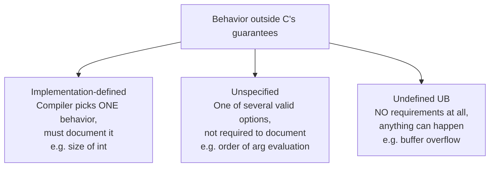

**Common examples of UB:**

```c
// 1. Buffer overflow / out-of-bounds access
int arr[5];
arr[10] = 1;             // UB: writing past array bounds

// 2. Dereferencing NULL or dangling pointers
int *p = NULL;
*p = 5;                    // UB (in practice, usually segfaults — but not guaranteed)

// 3. Signed integer overflow
int max = INT_MAX;
int overflow = max + 1;   // UB (unlike unsigned, which wraps predictably)

// 4. Using uninitialized variables
int x;
printf("%d\n", x);        // UB: x's value is indeterminate

// 5. Modifying a variable twice without a sequence point between
int i = 0;
i = i++ + ++i;              // UB: order/number of side effects on i is unspecified/UB

// 6. Division by zero
int z = 5 / 0;               // UB for integers (float division by 0 gives inf, defined)

// 7. Mismatched malloc/free, or freeing twice
int *p2 = malloc(sizeof(int));
free(p2);
free(p2);                    // UB: double free

// 8. Strict aliasing violations
float f = 1.0f;
int *ip = (int*)&f;
*ip = 0;                     // UB: accessing a float object through an int* (in general)

// 9. Returning from a non-void function without a return statement
int compute(void) {
    int x = 5;
    // missing return — UB if caller uses the "returned" value
}
```

**Why interviewers care:** UB is the root cause of countless real-world security vulnerabilities (buffer overflows enabling exploits) and "works on my machine" bugs (different compilers/optimization levels expose UB differently — code that "worked" can break after a compiler upgrade or `-O2` flag, since optimizers actively exploit UB assumptions to generate faster code).

**Defense in interviews — how to avoid UB:**
- Always initialize variables.
- Bounds-check array access.
- Check pointers for `NULL` before dereferencing.
- Use unsigned types (or overflow-checked arithmetic) where wraparound must be well-defined.
- Compile with `-Wall -Wextra -fsanitize=address,undefined` during development to catch UB early.

---
## 21. What are the differences between arrays and linked lists?

| Aspect | Array | Linked List |
|---|---|---|
| Memory layout | Contiguous block | Nodes scattered, linked via pointers |
| Size | Fixed at creation (static) or costly to resize | Dynamic — grows/shrinks at runtime easily |
| Access | O(1) random access via index | O(n) — must traverse from head |
| Insertion/deletion (middle) | O(n) — requires shifting elements | O(1) once you have the node (no shifting) |
| Insertion/deletion (end) | O(1) amortized (dynamic array) / O(n) (static) | O(1) if tail pointer kept, else O(n) |
| Memory overhead | None extra — just the data | Extra pointer(s) per node |
| Cache performance | Excellent (contiguous = cache-friendly) | Poor (nodes scattered, cache misses) |
| Reverse / traversal direction | Either direction trivially | Singly linked: forward only; doubly: both |

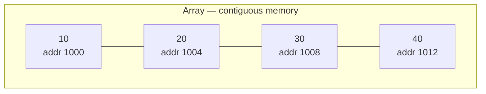
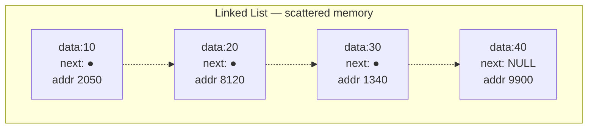

**When to choose which:**
- **Array**: you need fast random access, the size is known/bounded, or cache performance matters (numerical computing, image buffers).
- **Linked list**: frequent insertions/deletions in the middle, unknown/highly variable size, or you need O(1) insertion at a known position (e.g., LRU cache implementation).

---

## 22. What are the different types of linked lists and their use cases?

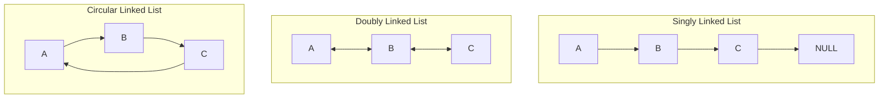

| Type | Structure | Use case |
|---|---|---|
| **Singly Linked List** | Each node points only to the *next* node | Simple stacks, forward-only traversal, memory-efficient when reverse traversal isn't needed |
| **Doubly Linked List** | Each node points to both *next* and *previous* | Browser back/forward history, LRU cache, text editor undo/redo, where backward traversal is needed |
| **Circular Linked List** | Last node points back to the first (singly or doubly) | Round-robin CPU scheduling, multiplayer turn rotation, circular buffers, playlist "repeat all" |
| **Circular Doubly Linked List** | Combines circular + doubly | Most flexible — used in implementations of deques, Linux kernel's `list_head` |

```c
// Singly linked list node
struct Node {
    int data;
    struct Node *next;
};

// Doubly linked list node
struct DNode {
    int data;
    struct DNode *next;
    struct DNode *prev;
};

// Circular: last node's `next` points back to head instead of NULL
```

**Real system examples:**
- Linux kernel uses a **circular doubly linked list** (`struct list_head`) pervasively for process lists, file descriptor tables, etc.
- **LRU cache** (used in CPU caches, browser caches, database buffer pools) is classically built with a doubly linked list + hash map for O(1) access and reordering.
- **Music/video player "repeat" queue** — circular linked list.

---

## 23. How does a linked list store data in memory compared to an array?

An array reserves **one contiguous block** of memory sized for all elements up front. A linked list allocates **each node separately** (typically via `malloc`), and nodes can end up anywhere in the heap — they're connected only logically, via pointers stored inside each node.

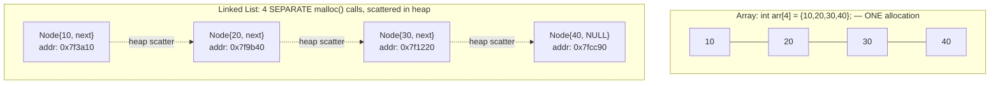

```c
// Array: single malloc, contiguous
int *arr = malloc(4 * sizeof(int));   // ONE block of 16 contiguous bytes
arr[0]=10; arr[1]=20; arr[2]=30; arr[3]=40;

// Linked list: 4 independent malloc calls — no guarantee of adjacency
struct Node *head = malloc(sizeof(struct Node));   // could be anywhere in heap
head->data = 10;
head->next = malloc(sizeof(struct Node));           // another, unrelated address
head->next->data = 20;
// ... and so on
```

**Practical consequence — cache locality:** because array elements sit next to each other, the CPU's cache prefetcher loads several elements at once on the first access, making sequential array traversal very fast. Linked list nodes, being scattered, often cause a **cache miss per node** during traversal — this is why, despite both being O(n) for traversal, arrays are typically faster in practice for that operation.

---

## 24. What are the advantages and disadvantages of using linked lists?

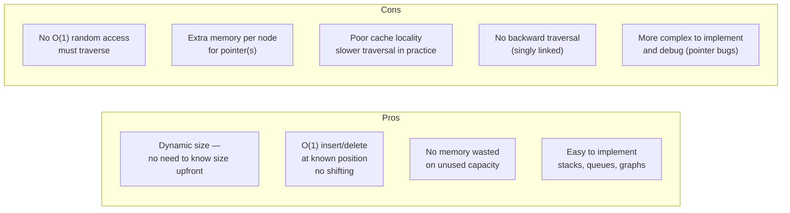

| Advantages | Disadvantages |
|---|---|
| Dynamic size — grows/shrinks without reallocation | No random access — `O(n)` to reach the *k*-th element |
| `O(1)` insertion/deletion once you have a reference to the node (no shifting needed, unlike arrays) | Extra memory overhead for storing pointers (~8 bytes per pointer on 64-bit) |
| No need to pre-declare a fixed capacity | Poor cache locality due to non-contiguous memory → slower in practice for traversal-heavy workloads |
| Efficient for implementing stacks, queues, adjacency lists for graphs | Singly linked lists can't be traversed backward; reversing is non-trivial |
| Easy to merge/split lists (just pointer reassignment) | More pointer bookkeeping → higher risk of bugs (leaks, dangling pointers, segfaults) |

---

## 25. Explain how a stack works internally. Where is it used in real systems?

A **stack** is a **LIFO (Last-In-First-Out)** data structure: the most recently added element is the first one removed. Core operations: `push` (add to top), `pop` (remove from top), `peek/top` (view top without removing).

```mermaid
flowchart TB
    subgraph "Stack operations"
    direction TB
        P1["push(10)"] --> S1["[10]"]
        P2["push(20)"] --> S2["[10, 20]"]
        P3["push(30)"] --> S3["[10, 20, 30] ← top"]
        P4["pop() returns 30"] --> S4["[10, 20] ← top"]
    end
```

**Two common implementations:**

```c
// 1. Array-based stack
#define MAX 100
struct Stack {
    int data[MAX];
    int top;      // index of the top element, -1 if empty
};

void push(struct Stack *s, int val) {
    if (s->top == MAX - 1) { /* overflow */ return; }
    s->data[++s->top] = val;
}

int pop(struct Stack *s) {
    if (s->top == -1) { /* underflow */ return -1; }
    return s->data[s->top--];
}

// 2. Linked-list-based stack (no fixed size limit)
struct Node { int data; struct Node *next; };

void push(struct Node **top, int val) {
    struct Node *n = malloc(sizeof(struct Node));
    n->data = val;
    n->next = *top;     // new node becomes the new head
    *top = n;
}

int pop(struct Node **top) {
    struct Node *temp = *top;
    int val = temp->data;
    *top = temp->next;
    free(temp);
    return val;
}
```

**Real-world uses:**
| Use case | How a stack is involved |
|---|---|
| **Function call stack** | Every function call pushes a frame; return pops it (see Q12) |
| **Undo/redo in editors** | Each action pushed onto an undo stack |
| **Expression evaluation** | Parsing/evaluating infix, postfix, prefix expressions; operator precedence (Shunting-yard algorithm) |
| **Balanced parentheses / syntax checking** | Push opening brackets, pop on matching closing bracket |
| **Browser back button** | Pages visited pushed onto a stack |
| **DFS (Depth-First Search)** | Explicit stack (or the implicit call stack via recursion) |
| **Backtracking algorithms** | Maze solving, N-Queens — push states, pop to backtrack |

Full demo: `code/ds/stack.c`

---

## 26. Explain how a queue works internally. What are its different variations?

A **queue** is a **FIFO (First-In-First-Out)** structure: elements are added at the **rear (enqueue)** and removed from the **front (dequeue)** — like a real-world line/queue.

```mermaid
flowchart LR
    E1["enqueue(10)"] --> Q1["[10]"]
    Q1 --> E2["enqueue(20)"]
    E2 --> Q2["front:[10, 20]:rear"]
    Q2 --> D1["dequeue() returns 10"]
    D1 --> Q3["front:[20]:rear"]
```

```c
// Linked-list-based queue (most flexible, no size limit)
struct Node { int data; struct Node *next; };
struct Queue { struct Node *front; struct Node *rear; };

void enqueue(struct Queue *q, int val) {
    struct Node *n = malloc(sizeof(struct Node));
    n->data = val; n->next = NULL;
    if (q->rear == NULL) { q->front = q->rear = n; return; }
    q->rear->next = n;
    q->rear = n;
}

int dequeue(struct Queue *q) {
    if (q->front == NULL) { /* empty */ return -1; }
    struct Node *temp = q->front;
    int val = temp->data;
    q->front = q->front->next;
    if (q->front == NULL) q->rear = NULL;
    free(temp);
    return val;
}
```

**Variations:**

| Type | Description | Use case |
|---|---|---|
| **Simple Queue** | Strict FIFO, insert at rear, remove at front | Task scheduling, print spooling |
| **Circular Queue** | Rear wraps around to reuse freed front space (array-based) | Fixed-size buffers, OS ring buffers (see Q28) |
| **Priority Queue** | Elements dequeued by priority, not insertion order | OS process scheduling, Dijkstra's/Prim's algorithms, event simulation (see Q36) |
| **Deque (Double-Ended Queue)** | Insertion/removal allowed at both ends | Sliding window problems, work-stealing schedulers, palindrome checking |

**Real-world uses:** CPU task scheduling, print job queues, BFS traversal, message queues (Kafka, RabbitMQ conceptually), buffering data streams (network packets, I/O), call center systems.

Full demo: `code/ds/queue.c`

---

## 27. What is the difference between stack and queue?

```mermaid
flowchart TB
    subgraph Stack["Stack — LIFO"]
    direction TB
        SK["push & pop\nat the SAME end (top)"]
    end
    subgraph Queue["Queue — FIFO"]
    direction TB
        QU["enqueue at REAR,\ndequeue at FRONT\n(different ends)"]
    end
```

| Aspect | Stack | Queue |
|---|---|---|
| Order | LIFO (Last-In-First-Out) | FIFO (First-In-First-Out) |
| Insertion point | Top | Rear |
| Removal point | Top | Front |
| Real-world analogy | Stack of plates | Line at a ticket counter |
| Key operations | `push`, `pop`, `peek` | `enqueue`, `dequeue`, `front`/`peek` |
| Typical uses | Function calls, undo, DFS, expression parsing | Scheduling, BFS, buffering, print spooling |
| Access pattern | Only one end active | Two ends, each with one role |

A quick interview one-liner: *"A stack reverses order (last in is first out); a queue preserves order (first in is first out)."*

---

## 28. Explain circular queue and why it is needed.

A **circular queue** is an array-based queue where the **rear wraps around to index 0** once it reaches the end of the array, instead of being treated as "full" — reusing slots freed by earlier dequeues.

```mermaid
flowchart TB
    subgraph "Problem with a simple array queue"
    direction LR
        P1["[_, _, _, 30, 40]\nfront=3, rear=4"] --> P2["after dequeuing 30,40:\n[_, _, _, _, _]\nfront=5 (out of bounds!)\nbut slots 0-2 are FREE and unused"]
    end
    subgraph "Circular queue solution"
    direction LR
        C1["rear wraps: (rear+1) % capacity"] --> C2["reuses freed slots 0,1,2\ninstead of wasting them"]
    end
```

**Why it's needed:** in a naive array-based queue, once `rear` reaches the last index, the queue is treated as "full" — even if many slots at the *front* have been freed by dequeues. This wastes memory. A circular queue solves this by wrapping the rear pointer back to index 0 using modulo arithmetic, reclaiming that freed space.

```c
#define SIZE 5
struct CircularQueue {
    int data[SIZE];
    int front, rear, count;
};

void enqueue(struct CircularQueue *q, int val) {
    if (q->count == SIZE) { /* full */ return; }
    q->rear = (q->rear + 1) % SIZE;   // wrap around
    q->data[q->rear] = val;
    q->count++;
}

int dequeue(struct CircularQueue *q) {
    if (q->count == 0) { /* empty */ return -1; }
    int val = q->data[q->front];
    q->front = (q->front + 1) % SIZE;  // wrap around
    q->count--;
    return val;
}
```

**Real-world uses:**
- **Ring buffers** in OS kernels for I/O buffering (keyboard input buffer, network packet buffers).
- **Audio/video streaming buffers** — fixed-size buffer continuously overwritten as data is produced/consumed.
- **CPU scheduling (round-robin)** — processes cycle through in a circular fashion.
- **Producer-consumer problems** in concurrent systems, where a fixed-size circular buffer decouples producer and consumer speeds.

Full demo: `code/ds/circular_queue.c`

---

## 29. What are the different tree data structures and where are they used?

A **tree** is a hierarchical, non-linear structure with a root node and child subtrees, no cycles.

```mermaid
flowchart TB
    subgraph "Generic Tree Terminology"
    direction TB
        R["Root"] --> C1["Child"]
        R --> C2["Child"]
        C1 --> G1["Grandchild\n(leaf)"]
        C1 --> G2["Grandchild\n(leaf)"]
        C2 --> G3["leaf"]
    end
```

| Tree type | Key property | Used for |
|---|---|---|
| **Binary Tree** | Each node has at most 2 children | General hierarchical data |
| **Binary Search Tree (BST)** | Left subtree < node < right subtree | Fast search/insert/delete (avg O(log n)) |
| **AVL Tree** | Self-balancing BST, height difference ≤ 1 | Guaranteed O(log n) operations, read-heavy workloads |
| **Red-Black Tree** | Self-balancing BST via coloring rules | Used in `std::map`/`std::set` (C++), Linux kernel schedulers, Java `TreeMap` |
| **B-Tree / B+ Tree** | Multi-way balanced tree, many children per node | Databases, filesystems (indexes — minimizes disk reads) |
| **Heap (Binary Heap)** | Complete binary tree, parent ≤ or ≥ children | Priority queues, heapsort, scheduling |
| **Trie (Prefix Tree)** | Each path represents a string prefix | Autocomplete, spell checkers, IP routing tables |
| **Segment Tree** | Each node represents a range/interval | Range queries (sum/min/max), competitive programming |
| **N-ary Tree** | Each node can have N children | File system directory structures, DOM trees in browsers |

```mermaid
flowchart TB
    subgraph "File system directory structure — N-ary tree example"
    direction TB
        ROOT["/"] --> HOME["home/"]
        ROOT --> ETC["etc/"]
        HOME --> USER["user/"]
        USER --> DOC["docs/"]
        USER --> PIC["pics/"]
    end
```

**Why trees matter:** they let us represent hierarchical relationships and, when balanced, give logarithmic-time search/insert/delete — far better than linear structures for large datasets.

---

## 30. What is the difference between a binary tree and a binary search tree?

A **binary tree** just constrains *shape* — each node has at most two children, with no rule about *values*. A **binary search tree (BST)** adds an *ordering rule*: for every node, all values in the left subtree are smaller, and all values in the right subtree are larger.

```mermaid
flowchart TB
    subgraph "Binary Tree — no ordering rule"
    direction TB
        BT1["50"] --> BT2["80"]
        BT1 --> BT3["20"]
        BT2 --> BT4["10"]
        BT2 --> BT5["90"]
    end
    subgraph "Binary Search Tree — left < node < right"
    direction TB
        BST1["50"] --> BST2["30"]
        BST1 --> BST3["70"]
        BST2 --> BST4["20"]
        BST2 --> BST5["40"]
        BST3 --> BST6["60"]
        BST3 --> BST7["80"]
    end
```

| Aspect | Binary Tree | Binary Search Tree (BST) |
|---|---|---|
| Child constraint | At most 2 children per node | At most 2 children per node |
| Value ordering | None — any arrangement | Left subtree < node < right subtree (strict ordering) |
| Search | O(n) — no shortcut, must check all nodes | O(log n) average (O(n) worst case if unbalanced) — can prune half the tree at each step |
| Use case | General hierarchical representation (e.g., expression trees, Huffman trees) | Fast lookup/insert/delete with ordering (databases, sets, dictionaries) |

```c
struct Node {
    int data;
    struct Node *left, *right;
};

// BST insert — relies on the ordering property
struct Node* insert(struct Node *root, int val) {
    if (root == NULL) {
        struct Node *n = malloc(sizeof(struct Node));
        n->data = val; n->left = n->right = NULL;
        return n;
    }
    if (val < root->data)
        root->left = insert(root->left, val);
    else if (val > root->data)
        root->right = insert(root->right, val);
    return root;
}

// BST search — O(log n) average, prunes half the tree each step
struct Node* search(struct Node *root, int val) {
    if (root == NULL || root->data == val) return root;
    if (val < root->data) return search(root->left, val);
    return search(root->right, val);
}
```

**Key interview point:** a BST's O(log n) guarantee depends on the tree being reasonably **balanced**. Inserting sorted data into a naive BST (e.g., 1,2,3,4,5 in order) degrades it into a linked list — O(n) operations. This is exactly why self-balancing trees (AVL, Red-Black — see Q32-34) exist.

Full demo: `code/ds/bst.c`

---
## 31. Explain tree traversal techniques and their applications.

Traversal means visiting every node in a tree exactly once, in some defined order. Broadly split into **depth-first (DFS)** variants and **breadth-first (BFS)**.

```mermaid
flowchart TB
    subgraph "Example tree"
    direction TB
        A["1"] --> B["2"]
        A --> C["3"]
        B --> D["4"]
        B --> E["5"]
    end
```

| Traversal | Order | Result on example tree | Typical use |
|---|---|---|---|
| **Preorder** (Root, Left, Right) | Visit node, then left subtree, then right | 1, 2, 4, 5, 3 | Copying/cloning a tree, prefix expression generation |
| **Inorder** (Left, Root, Right) | Left subtree, visit node, then right | 4, 2, 5, 1, 3 | Gives **sorted order** for a BST |
| **Postorder** (Left, Right, Root) | Left subtree, right subtree, then visit node | 4, 5, 2, 3, 1 | Deleting/freeing a tree safely (children before parent), postfix expressions |
| **Level-order (BFS)** | Visit all nodes level by level, left to right | 1, 2, 3, 4, 5 | Shortest-path-like problems, printing tree level by level, finding tree width |

```c
struct Node { int data; struct Node *left, *right; };

void preorder(struct Node *root) {
    if (root == NULL) return;
    printf("%d ", root->data);   // Root
    preorder(root->left);          // Left
    preorder(root->right);         // Right
}

void inorder(struct Node *root) {
    if (root == NULL) return;
    inorder(root->left);           // Left
    printf("%d ", root->data);    // Root
    inorder(root->right);          // Right
}

void postorder(struct Node *root) {
    if (root == NULL) return;
    postorder(root->left);          // Left
    postorder(root->right);         // Right
    printf("%d ", root->data);     // Root
}

// Level-order uses a QUEUE (not recursion)
void levelorder(struct Node *root) {
    if (root == NULL) return;
    struct Node *queue[100]; int front = 0, rear = 0;
    queue[rear++] = root;
    while (front < rear) {
        struct Node *cur = queue[front++];
        printf("%d ", cur->data);
        if (cur->left)  queue[rear++] = cur->left;
        if (cur->right) queue[rear++] = cur->right;
    }
}
```

**Why inorder gives sorted output on a BST:** by definition, left < node < right at every level — visiting left, then the node, then right recursively produces values in strictly increasing order. This is a very common interview "aha" question.

Full demo: `code/ds/tree_traversals.c`

---

## 32. What is a balanced tree? Why do we need balanced trees?

A tree is **balanced** when the height difference between the left and right subtrees of every node is bounded (typically by a small constant, like 1), keeping the overall tree height close to `O(log n)` rather than `O(n)`.

```mermaid
flowchart TB
    subgraph "Unbalanced BST — inserting 1,2,3,4,5 in order"
    direction TB
        U1["1"] --> U2["2"]
        U2 --> U3["3"]
        U3 --> U4["4"]
        U4 --> U5["5"]
    end
    subgraph "Balanced BST — same data, balanced"
    direction TB
        B1["3"] --> B2["2"]
        B1 --> B3["4"]
        B2 --> B4["1"]
        B3 --> B5["5"]
    end
```

**Why we need it:** a BST's O(log n) search/insert/delete guarantee only holds if the tree's height is `O(log n)`. An unbalanced tree (e.g., built by inserting already-sorted data) can degenerate into a structure where height = n — effectively a linked list, with **O(n)** operations, destroying the whole point of using a tree.

| | Unbalanced (worst case) | Balanced |
|---|---|---|
| Height | O(n) | O(log n) |
| Search/insert/delete | O(n) | O(log n) |

Self-balancing trees (AVL, Red-Black, B-trees) automatically perform **rotations** or other restructuring after insertions/deletions to maintain the balance property, guaranteeing logarithmic operations even in adversarial input orderings.

---

## 33. Explain AVL tree and how balancing is achieved.

An **AVL tree** (named after inventors Adelson-Velsky and Landis) is a self-balancing BST where, for **every node**, the height difference between left and right subtrees (the **balance factor**) is restricted to `{-1, 0, +1}`. If an insertion/deletion violates this, the tree performs **rotations** to restore balance.

```
balance factor = height(left subtree) - height(right subtree)
```

```mermaid
flowchart TB
    subgraph "Left-Left case → Right Rotation"
    direction LR
        LL1["30\nbf=+2"] --> LL2["20\nbf=+1"]
        LL2 --> LL3["10"]
    end
    subgraph "After Right Rotation"
    direction LR
        R1["20"] --> R2["10"]
        R1 --> R3["30"]
    end
```

**The four rotation cases:**

| Case | Trigger | Fix |
|---|---|---|
| **Left-Left (LL)** | Inserted into left subtree of left child | Single **right rotation** |
| **Right-Right (RR)** | Inserted into right subtree of right child | Single **left rotation** |
| **Left-Right (LR)** | Inserted into right subtree of left child | Left rotation on left child, then right rotation on root |
| **Right-Left (RL)** | Inserted into left subtree of right child | Right rotation on right child, then left rotation on root |

```c
struct Node { int data, height; struct Node *left, *right; };

int height(struct Node *n) { return n ? n->height : 0; }
int balanceFactor(struct Node *n) { return n ? height(n->left) - height(n->right) : 0; }

// Right rotation — fixes Left-Left case
struct Node* rightRotate(struct Node *y) {
    struct Node *x = y->left;
    struct Node *T2 = x->right;

    x->right = y;          // perform rotation
    y->left = T2;

    y->height = 1 + max(height(y->left), height(y->right));   // update heights
    x->height = 1 + max(height(x->left), height(x->right));

    return x;   // x becomes the new subtree root
}

struct Node* insert(struct Node *node, int val) {
    if (node == NULL) {
        struct Node *n = malloc(sizeof(struct Node));
        n->data = val; n->height = 1; n->left = n->right = NULL;
        return n;
    }
    if (val < node->data) node->left = insert(node->left, val);
    else if (val > node->data) node->right = insert(node->right, val);
    else return node;   // no duplicates

    node->height = 1 + max(height(node->left), height(node->right));
    int bf = balanceFactor(node);

    // LL case
    if (bf > 1 && val < node->left->data) return rightRotate(node);
    // RR case
    if (bf < -1 && val > node->right->data) return leftRotate(node);
    // LR case
    if (bf > 1 && val > node->left->data) {
        node->left = leftRotate(node->left);
        return rightRotate(node);
    }
    // RL case
    if (bf < -1 && val < node->right->data) {
        node->right = rightRotate(node->right);
        return leftRotate(node);
    }
    return node;
}
```

**Why AVL trees matter:** they guarantee **strict O(log n)** for search, insert, and delete in all cases — useful when read performance must be predictably fast and writes are less frequent (AVL rebalances more aggressively than Red-Black, so it's slightly slower on writes but faster on reads/lookups).

Full demo: `code/ds/avl_tree.c`

---

## 34. Explain Red-Black tree and where it is used.

A **Red-Black tree** is another self-balancing BST, but instead of strictly bounding height differences like AVL, it colors each node **red** or **black** and enforces a looser set of rules that still guarantee O(log n) height — at the cost of slightly more relaxed balance than AVL, but **fewer rotations** on insert/delete, making writes faster.

**The 5 Red-Black properties:**
1. Every node is either red or black.
2. The root is always black.
3. Every leaf (NIL/null) is considered black.
4. A red node cannot have a red child (**no two reds in a row**).
5. Every path from a node to its descendant NIL leaves has the **same number of black nodes** (the "black-height").

```mermaid
flowchart TB
    subgraph "Example Red-Black Tree"
    direction TB
        B1["10 (Black)"] --> R1["5 (Red)"]
        B1 --> R2["20 (Red)"]
        R1 --> B2["1 (Black)"]
        R1 --> B3["8 (Black)"]
        R2 --> B4["15 (Black)"]
        R2 --> B5["25 (Black)"]
    end
```

These rules guarantee the longest root-to-leaf path is never more than **2x** the shortest path, bounding height at `O(log n)`.

| AVL Tree | Red-Black Tree |
|---|---|
| Stricter balance (height diff ≤ 1) | Looser balance (allows up to 2x height difference) |
| Faster lookups (more balanced) | Faster insertions/deletions (fewer rotations needed) |
| Good for read-heavy workloads | Good for write-heavy / frequently-modified workloads |

**Where it's used in real systems:**
- C++ STL `std::map` and `std::set` (typically implemented as Red-Black trees).
- Java's `TreeMap` and `TreeSet`.
- Linux kernel — process scheduler (Completely Fair Scheduler uses a Red-Black tree to order tasks by virtual runtime), and the kernel's virtual memory area management.
- Used internally in many database index implementations as an in-memory balanced structure.

Implementing rotations and color-fixup logic in full is lengthy; the conceptual takeaway for interviews is usually: *"It's a self-balancing BST using node coloring + rotation rules to guarantee O(log n) height, favored over AVL when writes are frequent because it needs fewer rotations to rebalance."*

---

## 35. What is a heap data structure? Difference between min heap and max heap?

A **heap** is a **complete binary tree** (filled left to right, all levels full except possibly the last) satisfying the **heap property**:
- **Min-Heap**: every parent ≤ its children (smallest element at the root).
- **Max-Heap**: every parent ≥ its children (largest element at the root).

```mermaid
flowchart TB
    subgraph "Min-Heap"
    direction TB
        M1["10"] --> M2["20"]
        M1 --> M3["15"]
        M2 --> M4["30"]
        M2 --> M5["40"]
    end
    subgraph "Max-Heap"
    direction TB
        X1["50"] --> X2["30"]
        X1 --> X3["40"]
        X2 --> X4["10"]
        X2 --> X5["20"]
    end
```

**Key property:** a heap is *not* fully sorted like a BST — it only guarantees parent-child ordering, not sibling ordering. This weaker constraint is what makes insertion/extraction O(log n) but allows it to be stored efficiently as a plain **array** (no pointers needed):

```
For a node at index i (0-indexed array):
  left child  = 2*i + 1
  right child = 2*i + 2
  parent      = (i - 1) / 2
```

```mermaid
flowchart LR
    subgraph "Min-Heap [10,20,15,30,40] as an array"
    direction LR
        I0["idx0: 10"] --- I1["idx1: 20"] --- I2["idx2: 15"] --- I3["idx3: 30"] --- I4["idx4: 40"]
    end
```

```c
// Min-heap insert: add at end, "bubble up" (sift up) to restore heap property
void insert(int heap[], int *size, int val) {
    int i = (*size)++;
    heap[i] = val;
    while (i != 0 && heap[(i - 1) / 2] > heap[i]) {
        int parent = (i - 1) / 2;
        int temp = heap[i]; heap[i] = heap[parent]; heap[parent] = temp;
        i = parent;
    }
}

// Min-heap extract-min: remove root, move last element to root, "bubble down" (sift down)
int extractMin(int heap[], int *size) {
    int root = heap[0];
    heap[0] = heap[--(*size)];
    int i = 0;
    while (1) {
        int left = 2*i+1, right = 2*i+2, smallest = i;
        if (left < *size && heap[left] < heap[smallest]) smallest = left;
        if (right < *size && heap[right] < heap[smallest]) smallest = right;
        if (smallest == i) break;
        int temp = heap[i]; heap[i] = heap[smallest]; heap[smallest] = temp;
        i = smallest;
    }
    return root;
}
```

**Use cases:** priority queues (Q36), heapsort (O(n log n), in-place sorting), finding k-largest/smallest elements efficiently, Dijkstra's and Prim's graph algorithms, job/task scheduling by priority, median-finding (two-heap technique).

Full demo: `code/ds/min_max_heap.c`

---

## 36. How are priority queues implemented internally?

A **priority queue** is an abstract data type where each element has a priority, and the element with the highest (or lowest) priority is served first — *not* insertion order, unlike a plain queue.

```mermaid
flowchart TB
    A["Priority Queue ADT"] --> B["Implementation choice"]
    B --> C["Unsorted array/list\ninsert: O(1), extract-max: O(n)"]
    B --> D["Sorted array/list\ninsert: O(n), extract-max: O(1)"]
    B --> E["Binary Heap (most common)\ninsert: O(log n), extract-max: O(log n)"]
    B --> F["Balanced BST\ninsert: O(log n), extract-max: O(log n)\n+ supports arbitrary deletion"]
```

| Implementation | Insert | Extract Min/Max | Notes |
|---|---|---|---|
| Unsorted array | O(1) | O(n) — must scan for the priority element | Simple, slow extraction |
| Sorted array | O(n) — must shift to maintain order | O(1) — it's always at the end/front | Slow insertion |
| **Binary Heap** | **O(log n)** | **O(log n)** | The standard choice — balanced cost, simple array-based storage |
| Balanced BST (e.g., Red-Black) | O(log n) | O(log n) | Used when arbitrary-element deletion or in-order traversal is also needed |
| Fibonacci Heap | O(1) amortized | O(log n) | Used in advanced graph algorithms (theoretical Dijkstra/Prim speedups) |

**Why binary heaps dominate in practice:** they're array-backed (no pointer overhead like a tree), cache-friendly, and give a clean `O(log n)` for both insert and extract — the best practical balance for most use cases.

```c
// C's standard library has no built-in priority queue —
// typically built using the heap functions above, or via qsort-based
// workarounds for simple cases, or custom heap implementations.
// (C++ provides std::priority_queue, built on a binary heap internally.)
```

**Real-world uses:** OS process/task schedulers (run the highest-priority process next), Dijkstra's shortest path algorithm (always expand the closest unvisited node), Huffman coding (build the tree by always merging the two lowest-frequency nodes), event-driven simulations (process events in time order), A* pathfinding.

---

## 37. What is hashing? How does a hash table work internally?

**Hashing** is the process of converting a key (of any size — string, number, object) into a fixed-size integer (the **hash code**) via a **hash function**, then using that integer (modulo table size) as an index into an array — giving average **O(1)** insert/search/delete.

```mermaid
flowchart LR
    K["key: \"apple\""] -->|"hash function\nh(key)"| H["hash code: 93871"]
    H -->|"% table_size\n(e.g. % 10)"| IDX["index: 1"]
    IDX --> ARR["bucket[1] → stores the\nkey-value pair"]
```

```mermaid
flowchart TB
    subgraph "Hash Table internal array"
    direction LR
        B0["bucket 0\nempty"] --- B1["bucket 1\n(\"apple\", 5)"] --- B2["bucket 2\nempty"] --- B3["bucket 3\n(\"cat\", 9)"]
    end
```

**Components:**
1. **Hash function** — maps a key to an integer, ideally distributing keys uniformly to minimize clustering. e.g., for strings: `sum of char codes * prime ^ position`, then `% table_size`.
2. **Buckets/slots** — the underlying array where values are stored, indexed by hash.
3. **Collision handling** — strategy for when two keys hash to the same index (see Q38).

```c
#define TABLE_SIZE 100

unsigned int hash(const char *key) {
    unsigned int hash_val = 0;
    while (*key) {
        hash_val = (hash_val * 31) + *key;   // simple polynomial rolling hash
        key++;
    }
    return hash_val % TABLE_SIZE;
}

struct Entry { char *key; int value; struct Entry *next; };  // chaining for collisions
struct Entry *table[TABLE_SIZE];

void insert(const char *key, int value) {
    unsigned int idx = hash(key);
    struct Entry *e = malloc(sizeof(struct Entry));
    e->key = strdup(key);
    e->value = value;
    e->next = table[idx];   // insert at head of the chain (collision handling)
    table[idx] = e;
}

int* lookup(const char *key) {
    unsigned int idx = hash(key);
    for (struct Entry *e = table[idx]; e != NULL; e = e->next) {
        if (strcmp(e->key, key) == 0) return &e->value;
    }
    return NULL;   // not found
}
```

**Why average O(1):** a well-distributed hash function spreads keys roughly evenly across buckets, so each bucket holds only a small constant number of entries on average, regardless of total dataset size. Worst case (all keys hashing to one bucket) degrades to O(n) — which is why hash function quality and resizing (rehashing as the **load factor** grows) matter.

**Real-world uses:** language dictionaries/maps (Python `dict`, Java `HashMap`, C++ `unordered_map`), database indexing, caching layers, deduplication, password storage (cryptographic hashing — different goals than table hashing, but related concept), symbol tables in compilers.

Full demo: `code/ds/hash_table.c`

---

## 38. What are collision handling techniques in hashing?

A **collision** occurs when two different keys hash to the same bucket index. Since this is statistically inevitable (pigeonhole principle, especially as the table fills up), every hash table needs a strategy to handle it.

```mermaid
flowchart TB
    subgraph "Separate Chaining"
    direction LR
        B1["bucket 3"] --> N1["(\"cat\",9)"] --> N2["(\"dog\",4)"] --> N3["(\"bat\",2)"]
    end
```
```mermaid
flowchart LR
    subgraph "Open Addressing (Linear Probing)"
    direction LR
        S0["slot0\nempty"] --- S1["slot1\n\"cat\""] --- S2["slot2\n\"dog\" ← collided\nwith slot1,\nprobed to slot2"] --- S3["slot3\nempty"]
    end
```

| Technique | How it works | Pros | Cons |
|---|---|---|---|
| **Separate Chaining** | Each bucket holds a linked list (or other structure) of all entries that hash there | Simple, handles unlimited collisions, easy deletion | Extra memory for pointers, worse cache locality |
| **Open Addressing — Linear Probing** | On collision, check the next slot `(idx+1) % size`, then next, etc. | Good cache locality (contiguous array) | Clustering — collisions tend to cluster together, degrading performance |
| **Open Addressing — Quadratic Probing** | On collision, check `idx + 1², idx + 2², ...` | Reduces clustering vs linear | More complex; can still cluster ("secondary clustering") |
| **Open Addressing — Double Hashing** | On collision, use a second hash function to compute the step size | Best collision distribution among probing methods | More computation per lookup |
| **Robin Hood Hashing** | Open addressing variant; "steals" slots from entries closer to their ideal position | Reduces variance in probe length | More complex implementation |

```c
// Separate chaining — shown fully in Q37's hash table example

// Linear probing example
int find_slot(int table[], int size, int key) {
    int idx = key % size;
    int start = idx;
    while (table[idx] != EMPTY && table[idx] != key) {
        idx = (idx + 1) % size;     // probe next slot
        if (idx == start) return -1; // full table, searched everywhere
    }
    return idx;
}
```

**Choosing between them:** chaining is simpler and more common in general-purpose libraries (handles arbitrary load factors gracefully); open addressing is often faster in practice due to cache locality, but requires careful load-factor management (typically resize/rehash once load factor exceeds ~0.7) and special handling for deletions (using "tombstone" markers, since simply clearing a slot can break probe chains).

---

## 39. Explain graph representations: adjacency matrix vs adjacency list.

A **graph** is a set of vertices (nodes) connected by edges. Two standard ways to represent one in memory:

```mermaid
flowchart LR
    subgraph "Example Graph"
    direction LR
        V0["0"] --- V1["1"]
        V0 --- V2["2"]
        V1 --- V2
        V1 --- V3["3"]
    end
```

**Adjacency Matrix** — a 2D array `matrix[V][V]` where `matrix[i][j] = 1` (or weight) if an edge exists between `i` and `j`, else `0`.

```
     0   1   2   3
  0 [0,  1,  1,  0]
  1 [1,  0,  1,  1]
  2 [1,  1,  0,  0]
  3 [0,  1,  0,  0]
```

**Adjacency List** — an array of lists, where `list[i]` contains all vertices adjacent to `i`.

```mermaid
flowchart LR
    A0["0"] --> A0L["1 → 2"]
    A1["1"] --> A1L["0 → 2 → 3"]
    A2["2"] --> A2L["0 → 1"]
    A3["3"] --> A3L["1"]
```

```c
// Adjacency Matrix
#define V 4
int matrix[V][V] = {0};
void addEdge(int u, int w) { matrix[u][w] = 1; matrix[w][u] = 1; }  // undirected

// Adjacency List
struct Node { int dest; struct Node *next; };
struct Node *adjList[V];
void addEdge(int u, int w) {
    struct Node *n = malloc(sizeof(struct Node));
    n->dest = w; n->next = adjList[u]; adjList[u] = n;
    // for undirected graph, also add the reverse edge
    n = malloc(sizeof(struct Node));
    n->dest = u; n->next = adjList[w]; adjList[w] = n;
}
```

| Aspect | Adjacency Matrix | Adjacency List |
|---|---|---|
| Space | O(V²) — wasteful for sparse graphs | O(V + E) — efficient, especially for sparse graphs |
| Check if edge (u,v) exists | O(1) — direct lookup | O(degree(u)) — must scan u's list |
| Iterate all neighbors of a node | O(V) — scan whole row, even non-edges | O(degree(u)) — only actual edges |
| Add/remove edge | O(1) | O(1) for add; O(degree) for remove |
| Best for | Dense graphs, or when fast edge-existence checks matter | Sparse graphs (most real-world graphs), memory-constrained scenarios |

**Real-world choice:** most real-world graphs (social networks, road networks, web link graphs) are **sparse** (E << V²), so adjacency lists are far more memory-efficient and are the default choice in practice. Adjacency matrices are preferred for dense graphs or algorithms needing O(1) edge lookups (e.g., some dynamic programming formulations on graphs).

---

## 40. What are the differences between BFS and DFS and where are they used?

Both are graph/tree **traversal algorithms**, but they explore in fundamentally different orders.

```mermaid
flowchart TB
    subgraph "Example Graph"
    direction TB
        A["A"] --> B["B"]
        A --> C["C"]
        B --> D["D"]
        B --> E["E"]
        C --> F["F"]
    end
```

```mermaid
flowchart LR
    subgraph "BFS from A — level by level, uses a QUEUE"
    direction LR
        BA["A"] --> BB["B,C"] --> BC["D,E,F"]
    end
```
```mermaid
flowchart LR
    subgraph "DFS from A — goes deep first, uses a STACK / recursion"
    direction LR
        DA["A"] --> DB["B"] --> DC["D"] --> DD["backtrack to B"] --> DE["E"] --> DF["backtrack to A"] --> DG["C"] --> DH["F"]
    end
```

| Aspect | BFS (Breadth-First Search) | DFS (Depth-First Search) |
|---|---|---|
| Strategy | Explore all neighbors at the current depth before going deeper | Go as deep as possible down one path before backtracking |
| Data structure used | **Queue** (FIFO) | **Stack** (explicit) or recursion (implicit call stack) |
| Memory usage | Can be high — stores an entire "frontier" level | Generally lower — only stores the current path |
| Shortest path (unweighted graph) | **Yes** — guarantees shortest path in terms of edge count | No guarantee — may find a longer path first |
| Use cases | Shortest path in unweighted graphs, level-order tree traversal, finding connected components, web crawlers (level-by-level), social network "degrees of separation" | Topological sorting, cycle detection, maze/puzzle solving, finding connected components, backtracking (N-Queens, Sudoku), pathfinding when *any* path (not shortest) is acceptable |

```c
// BFS — uses a queue
void bfs(int start, struct Node *adjList[], int V) {
    int visited[V]; memset(visited, 0, sizeof(visited));
    int queue[V], front = 0, rear = 0;

    visited[start] = 1;
    queue[rear++] = start;

    while (front < rear) {
        int curr = queue[front++];
        printf("%d ", curr);
        for (struct Node *n = adjList[curr]; n != NULL; n = n->next) {
            if (!visited[n->dest]) {
                visited[n->dest] = 1;
                queue[rear++] = n->dest;
            }
        }
    }
}

// DFS — uses recursion (implicit stack)
void dfs(int curr, struct Node *adjList[], int visited[]) {
    visited[curr] = 1;
    printf("%d ", curr);
    for (struct Node *n = adjList[curr]; n != NULL; n = n->next) {
        if (!visited[n->dest]) {
            dfs(n->dest, adjList, visited);
        }
    }
}
```

**Quick interview heuristic:** *"Need the shortest path or to process things level by level? Use BFS. Need to explore all possibilities deeply, detect cycles, or do backtracking? Use DFS."*

**Complexity (both):** O(V + E) — every vertex and edge visited once, given an adjacency list representation.

Full demo: `code/ds/bfs_dfs.c`

---

## Quick Reference — Time Complexity Cheat Sheet

| Structure | Access | Search | Insert | Delete |
|---|---|---|---|---|
| Array | O(1) | O(n) | O(n) | O(n) |
| Linked List | O(n) | O(n) | O(1)* | O(1)* |
| Stack / Queue | O(n) | O(n) | O(1) | O(1) |
| BST (balanced) | O(log n) | O(log n) | O(log n) | O(log n) |
| BST (worst case) | O(n) | O(n) | O(n) | O(n) |
| AVL / Red-Black Tree | O(log n) | O(log n) | O(log n) | O(log n) |
| Binary Heap | O(1) for min/max | O(n) | O(log n) | O(log n) |
| Hash Table (avg) | — | O(1) | O(1) | O(1) |
| Hash Table (worst) | — | O(n) | O(n) | O(n) |

*\*O(1) at a known position; O(n) if you need to search for the position first.*

---

